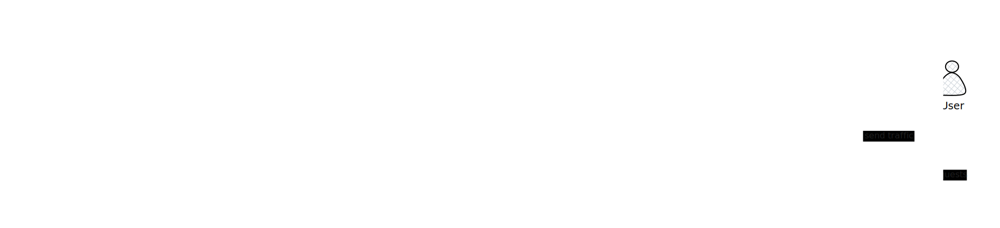
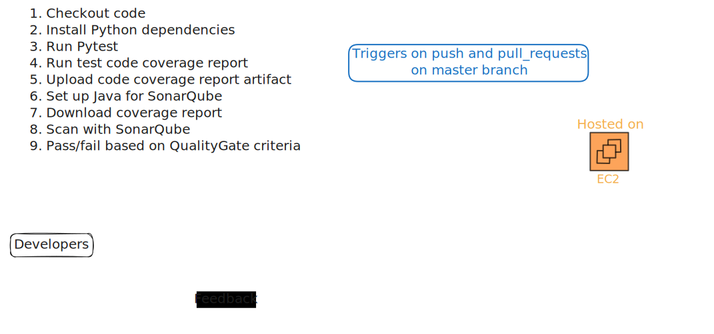
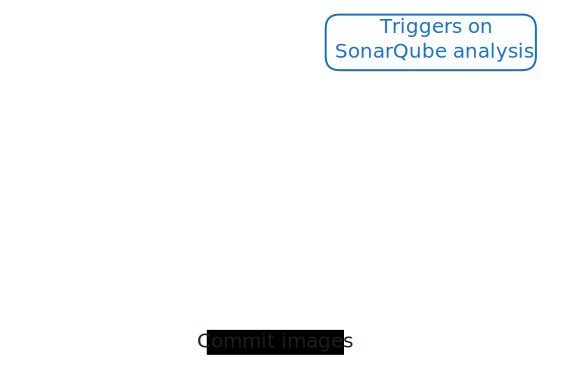
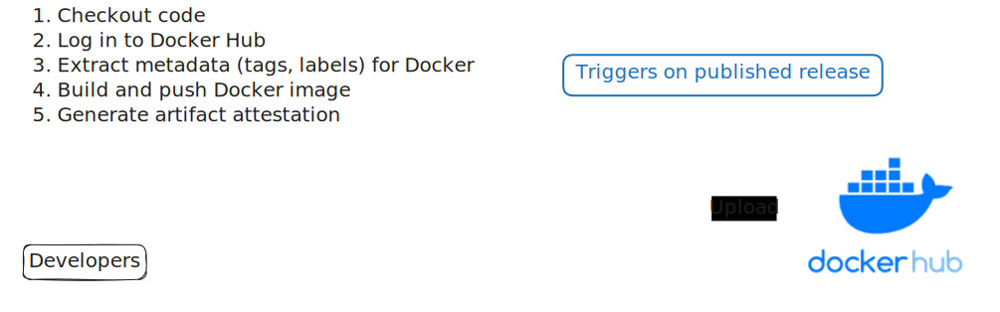
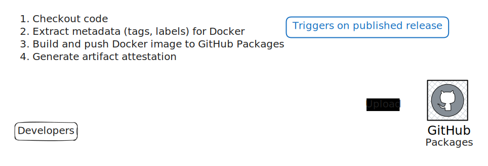
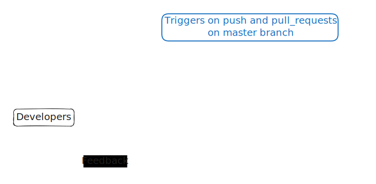

# Automated CI/CD System with SonarQube, GitHub Actions, and AWS Deployment.

This project implements a fully automated DevSecOps pipeline for Python packages, integrating code quality, security, and deployment workflows. The system:

- Runs unit tests for multiple Python packages within GitHub Actions.
- Performs static code analysis and security scans using SonarQube and security agents (hosted in AWS).
- Enforces compliance by automatically merging code only if quality gates and coverage thresholds are met.
- Updates the project README with latest test coverage and reports, pulling information from both SonarQube and GitHub Releases.
- Builds Docker images and publishes them to GitHub Container Registry.
- Deploys validated artifacts to AWS infrastructure.

## SonarQube report

|Current code status | |
|---	|---	|

|Current Status |Acceptance Condition|   
|---	|---	|
| |New code has 0 security issues|
| |New code has 0 reliability issues |
| |New code has at least 80% coverage |
| |Code has less than 3% of lines duplicated |

## GitHub Actions breakdown

### SonarQube analysis

### Update SonarQube analysis results badges  

### Publish Docker image to Docker Hub

### Publish Docker image to GitHub packages

### Run Python unit tests

### Deploy in AWS Elastic Container Service

